# AI Data Modeler - Complete Guide

> An AI-powered data modeling tool that transforms natural language descriptions into professional Entity-Relationship Diagrams (ERDs) using Groq's Llama 3.3 70B model.

---

## Table of Contents

1. [Overview](#overview)
2. [Architecture](#architecture)
3. [Core Components](#core-components)
4. [Data Flow](#data-flow)
5. [Features](#features)
6. [Tech Stack](#tech-stack)
7. [Getting Started](#getting-started)
8. [Deployment](#deployment)
9. [Roadmap](#roadmap)
10. [Troubleshooting](#troubleshooting)

---

## Overview

AI Data Modeler is a modern web application that revolutionizes database design by allowing users to describe their data requirements in plain English. The AI interprets these descriptions and generates complete ERDs with:

- **Entities** (tables) with appropriate attributes
- **Relationships** with proper cardinality
- **Crow's Foot Notation** for professional visualization
- **Interactive Canvas** for visual editing

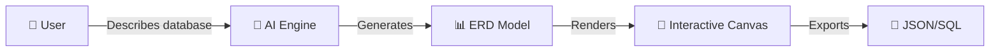

### Key Capabilities

| Capability | Description |
|------------|-------------|
| Natural Language Input | Describe databases in plain English |
| AI-Powered Generation | Llama 3.3 70B via Groq API |
| Real-time Chat | Modify models conversationally |
| Visual Editor | Drag, pan, zoom entities |
| Direct Editing | Double-click entities/relationships to edit |
| Properties Panel | Inline editing of all properties |
| SQL DDL Export | Export to PostgreSQL, MySQL, SQL Server, Oracle, SQLite |
| SQL Import | Reverse engineer ERD from existing SQL DDL files |
| Light/Dark Mode | Toggle between themes |
| Auto-Layout | Smart entity positioning |
| Persistence | Auto-save to browser storage |

---

## Architecture

### High-Level Architecture

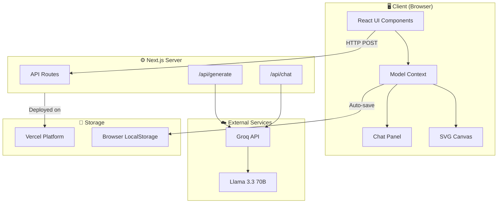

### Component Architecture

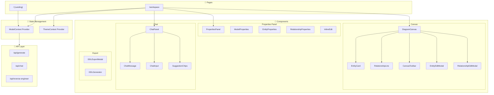

---

## Core Components

### 1. Model Context (`src/context/ModelContext.tsx`)

The central state management hub using React Context API.

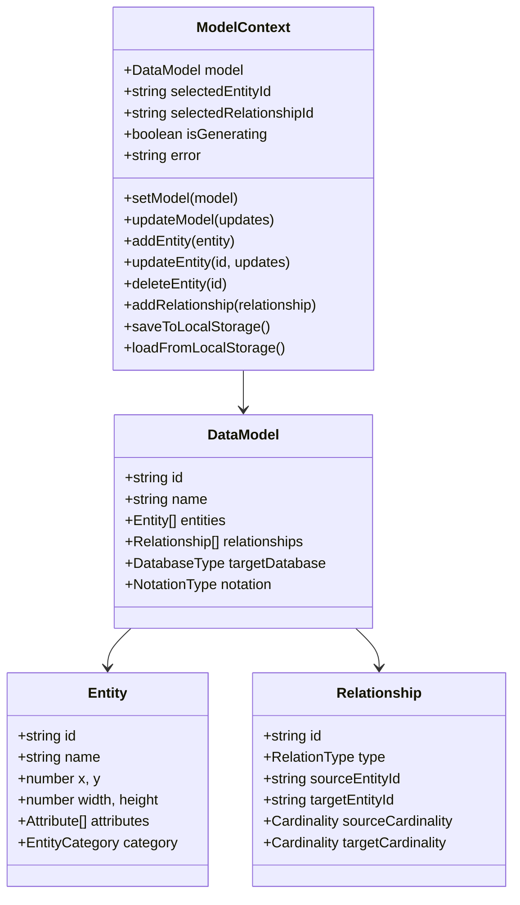

### 2. Diagram Canvas (`src/components/canvas/DiagramCanvas.tsx`)

SVG-based interactive canvas with pan, zoom, and drag capabilities.

| Feature | Implementation |
|---------|----------------|
| Zoom | Ctrl/Cmd + Scroll wheel (0.1x - 3x) |
| Pan | Hand tool + drag |
| Select | Click on entity/relationship |
| Move | Select tool + drag entity |
| Grid | Toggle-able 20px grid pattern |

### 3. Entity Card (`src/components/canvas/EntityCard.tsx`)

Visual representation of database tables.

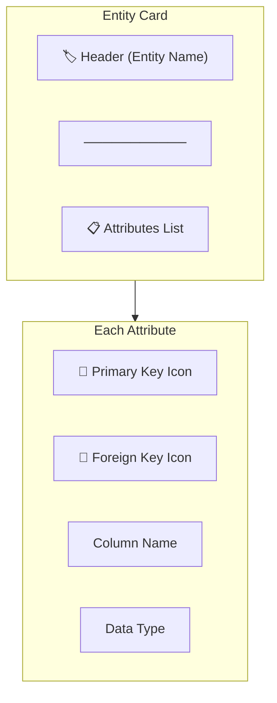

### 4. Chat Panel (`src/components/chat/ChatPanel.tsx`)

Conversational interface for model modifications.

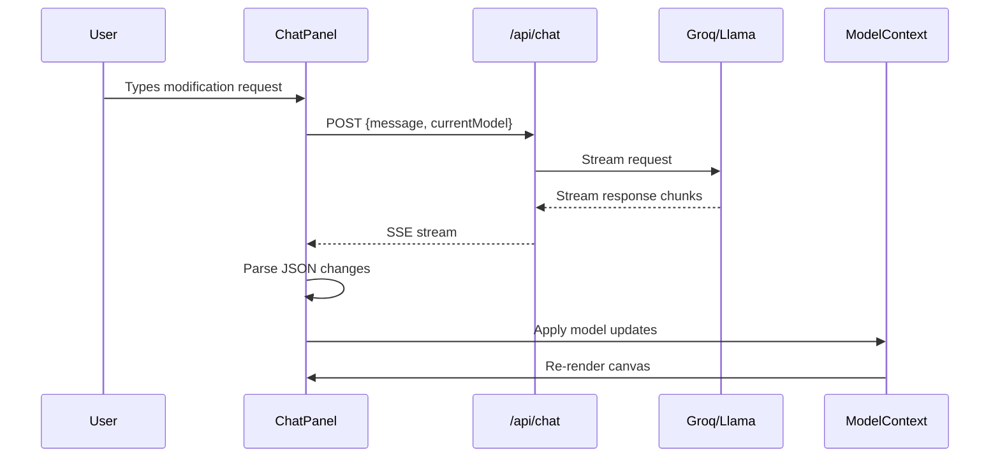

---

## Data Flow

### Generation Flow

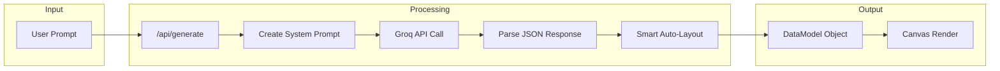

### Chat Modification Flow

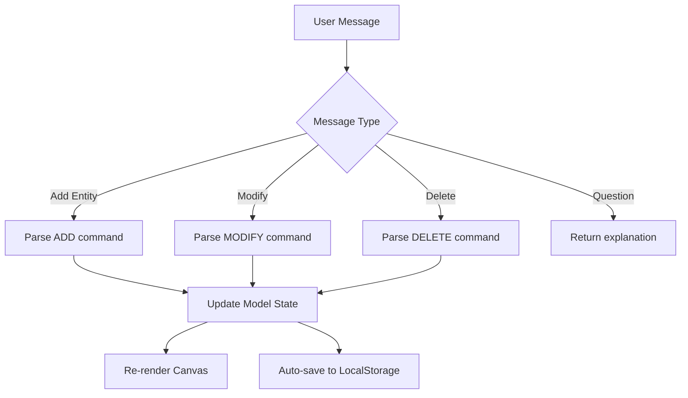

### State Management Flow

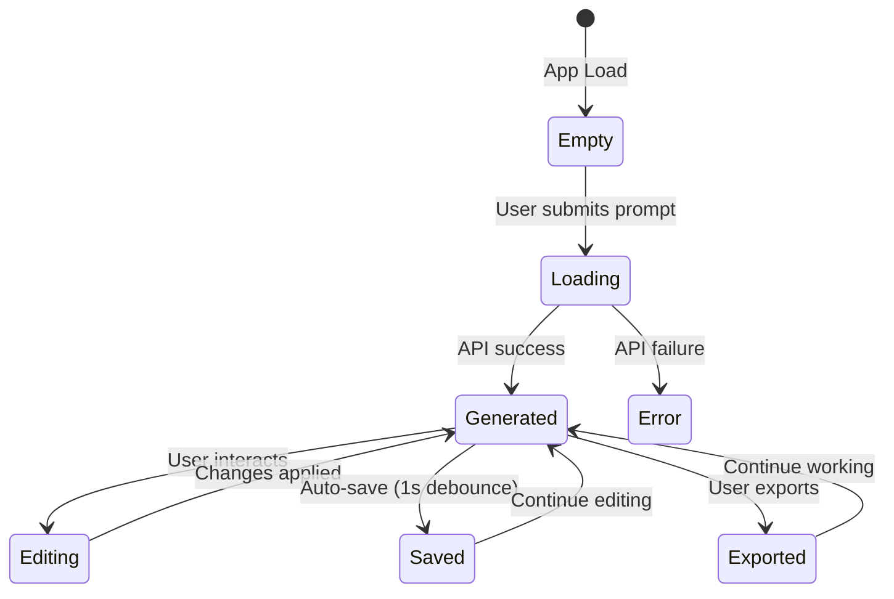

---

## Features

### Current Features

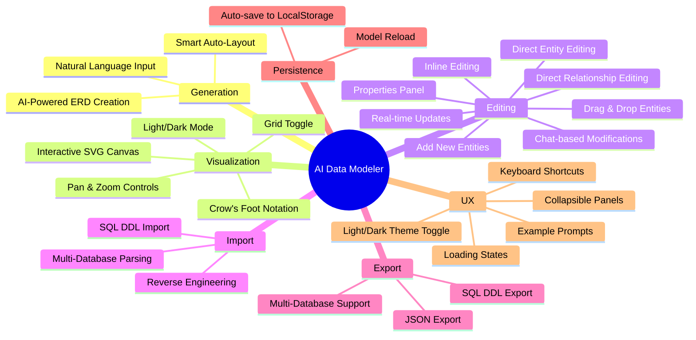

### Keyboard Shortcuts

| Key | Action |
|-----|--------|
| `V` | Select tool |
| `H` | Pan/Hand tool |
| `+` / `=` | Zoom in |
| `-` / `_` | Zoom out |
| `0` | Reset zoom |
| `Ctrl + Scroll` | Zoom |
| `Enter` | Edit selected entity/relationship |
| `Delete` / `Backspace` | Delete selected item |
| `Double-click` | Open edit modal |

### SQL DDL Export

Export your data model to SQL for multiple database systems:

| Database | Features |
|----------|----------|
| PostgreSQL | Full support with JSONB, comments |
| MySQL | TINYINT for booleans, JSON type |
| SQL Server | NVARCHAR, BIT, DATETIME2 |
| Oracle | NUMBER types, VARCHAR2, CLOB |
| SQLite | Simplified types, AUTOINCREMENT |

**Export Options:**
- Include DROP statements
- Include comments
- Include foreign keys
- Include indexes

### SQL Import / Reverse Engineering

Import existing SQL DDL files to generate ERD diagrams:

| Feature | Description |
|---------|-------------|
| File Upload | Import .sql files from landing page or workspace |
| AI-Powered Parsing | Uses Llama 3.3 70B to extract entities and relationships |
| Multi-Database Support | Parses PostgreSQL, MySQL, SQL Server, Oracle, SQLite syntax |
| Smart Detection | Identifies primary keys, foreign keys, indexes, and constraints |
| Auto-Layout | Automatically positions entities after import |

**How to Import:**
1. Click "Import SQL" button on landing page or workspace header
2. Select a .sql file containing CREATE TABLE statements
3. AI analyzes the DDL and generates the ERD
4. Review and edit the generated model as needed

### Properties Panel

The Properties Panel provides inline editing for all model elements:

| View | Properties |
|------|------------|
| Model (nothing selected) | Name, description, target database, entity list |
| Entity (selected) | Name, physical name, category, description, attributes |
| Relationship (selected) | Name, type, cardinality, source/target entities |

**Inline Editing Features:**
- Click any property to edit
- Press Enter to save, Escape to cancel
- Checkbox toggles for constraints
- Dropdown selects for types/categories

### Entity Categories

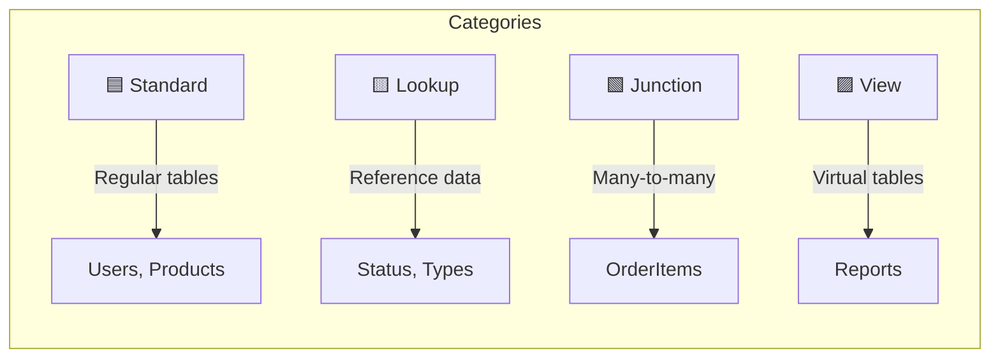

---

## Tech Stack

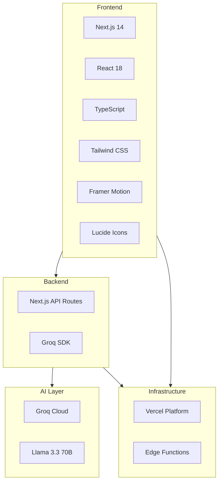

### Dependencies

| Package | Version | Purpose |
|---------|---------|---------|
| next | 14.2.5 | React framework |
| react | ^18.3.1 | UI library |
| groq-sdk | ^0.5.0 | AI API client |
| framer-motion | ^11.0.0 | Animations |
| lucide-react | ^0.263.1 | Icons |
| uuid | ^9.0.0 | ID generation |
| tailwindcss | ^3.4.4 | Styling |
| typescript | ^5.5.3 | Type safety |

---

## Getting Started

### Prerequisites

- Node.js 18+
- npm or yarn
- Groq API key (free at [console.groq.com](https://console.groq.com/keys))

### Installation

```bash
# Clone the repository
git clone https://github.com/pandeyraunak007/ai-data-modeler.git
cd ai-data-modeler

# Install dependencies
npm install

# Configure environment
cp .env.local.example .env.local
# Edit .env.local and add your GROQ_API_KEY

# Start development server
npm run dev
```

### Environment Variables

```env
# Required
GROQ_API_KEY=gsk_your_api_key_here

# Optional (defaults shown)
# GROQ_MODEL=llama-3.3-70b-versatile
```

### Project Structure

```
ai-data-modeler/
├── src/
│   ├── app/
│   │   ├── page.tsx              # Landing page
│   │   ├── workspace/page.tsx    # Main workspace
│   │   ├── layout.tsx            # Root layout
│   │   ├── globals.css           # Global styles
│   │   └── api/
│   │       ├── generate/route.ts          # ERD generation
│   │       ├── chat/route.ts              # Chat modifications
│   │       └── reverse-engineer/route.ts  # SQL import
│   ├── components/
│   │   ├── canvas/               # Canvas components
│   │   │   ├── DiagramCanvas.tsx
│   │   │   ├── EntityCard.tsx
│   │   │   ├── RelationshipLine.tsx
│   │   │   ├── CanvasToolbar.tsx
│   │   │   ├── EntityEditModal.tsx
│   │   │   └── RelationshipEditModal.tsx
│   │   ├── chat/                 # Chat components
│   │   │   ├── ChatPanel.tsx
│   │   │   ├── ChatMessage.tsx
│   │   │   ├── ChatInput.tsx
│   │   │   └── SuggestionChips.tsx
│   │   ├── properties/           # Properties panel
│   │   │   ├── PropertiesPanel.tsx
│   │   │   ├── ModelProperties.tsx
│   │   │   ├── EntityProperties.tsx
│   │   │   ├── RelationshipProperties.tsx
│   │   │   └── InlineEdit.tsx
│   │   └── DDLExportModal.tsx    # SQL export
│   ├── context/
│   │   ├── ModelContext.tsx      # Model state
│   │   └── ThemeContext.tsx      # Theme state
│   ├── lib/
│   │   ├── groq.ts               # Groq client
│   │   ├── autoLayout.ts         # Entity positioning
│   │   ├── ddlGenerator.ts       # SQL DDL generation
│   │   └── prompts/              # AI prompts
│   └── types/
│       ├── model.ts              # Data types
│       └── chat.ts               # Chat types
├── .env.local                    # Environment variables
├── Guide.md                      # This documentation
├── issues.md                     # Issue tracking
├── package.json
└── tailwind.config.ts
```

---

## Deployment

### Vercel Deployment (Recommended)

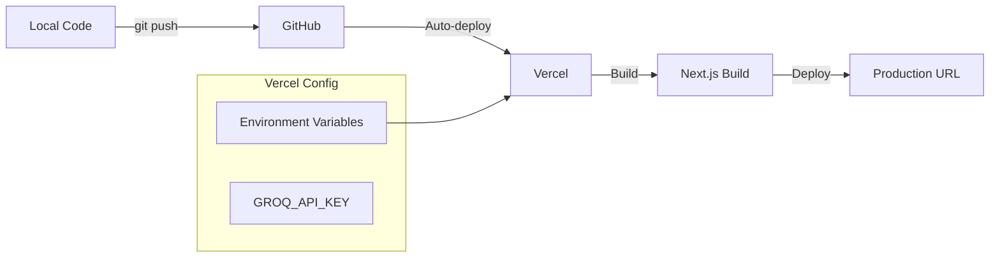

#### Steps

1. **Push to GitHub**
   ```bash
   git add .
   git commit -m "Initial commit"
   git push origin main
   ```

2. **Deploy to Vercel**
   ```bash
   # Using Vercel CLI
   vercel --prod

   # Or connect via Vercel Dashboard
   # https://vercel.com/new
   ```

3. **Configure Environment Variables**
   ```bash
   vercel env add GROQ_API_KEY production
   ```

### Manual Deployment

```bash
# Build for production
npm run build

# Start production server
npm start
```

### Docker Deployment

```dockerfile
FROM node:18-alpine
WORKDIR /app
COPY package*.json ./
RUN npm ci
COPY . .
RUN npm run build
EXPOSE 3000
CMD ["npm", "start"]
```

---

## Roadmap

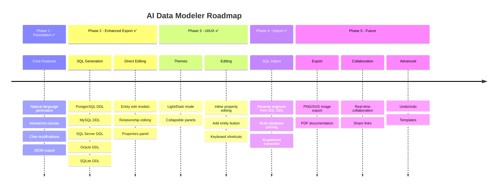

### Feature Status

| Priority | Feature | Status |
|----------|---------|--------|
| High | SQL DDL export (5 databases) | ✅ Complete |
| High | Direct entity editing | ✅ Complete |
| High | Properties panel | ✅ Complete |
| High | Light/Dark mode | ✅ Complete |
| High | SQL Import / Reverse engineering | ✅ Complete |
| Medium | Inline editing | ✅ Complete |
| Medium | Keyboard shortcuts | ✅ Complete |
| Medium | PNG/SVG image export | Planned |
| Medium | Undo/Redo system | Planned |
| Low | Real-time collaboration | Future |
| Low | Template library | Future |

---

## Troubleshooting

### Common Issues

#### 1. "AI service not configured" Error

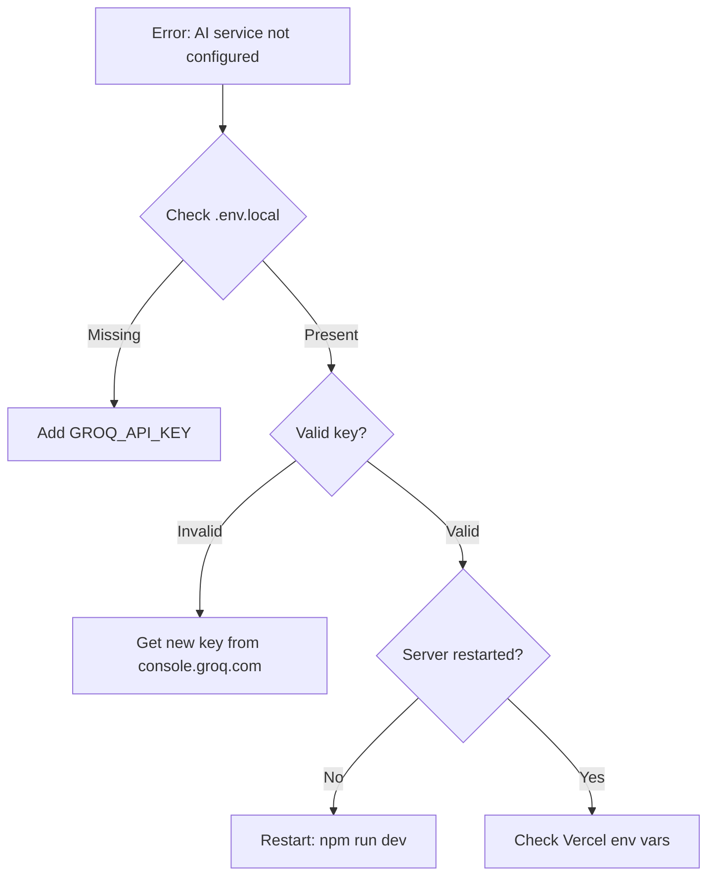

**Solution:**
```bash
# Verify .env.local exists and contains
GROQ_API_KEY=gsk_your_actual_key_here

# Restart development server
npm run dev
```

#### 2. Canvas Not Rendering

| Symptom | Cause | Solution |
|---------|-------|----------|
| Blank canvas | No model loaded | Generate a model first |
| Entities off-screen | Pan offset | Press `0` to reset view |
| Relationships missing | Invalid entity IDs | Regenerate model |

#### 3. Chat Not Responding

**Check streaming connection:**
- Ensure no ad-blockers blocking SSE
- Check browser console for errors
- Verify API route is accessible

#### 4. LocalStorage Issues

```javascript
// Clear stored model (in browser console)
localStorage.removeItem('ai-data-modeler-model');

// Reload page
location.reload();
```

#### 5. Build Failures

```bash
# Clear Next.js cache
rm -rf .next

# Clear node_modules and reinstall
rm -rf node_modules
npm install

# Rebuild
npm run build
```

### Debug Mode

Enable verbose logging:
```typescript
// In src/lib/groq.ts
console.log('API Request:', messages);
console.log('API Response:', response);
```

### Getting Help

- **GitHub Issues**: [Report bugs](https://github.com/pandeyraunak007/ai-data-modeler/issues)
- **Discussions**: Feature requests and questions

---

## License

MIT License - See [LICENSE](LICENSE) for details.

---

<div align="center">

**Created by Raunak Pandey**

Built with Next.js & Groq AI

[Live Demo](https://ai-data-modeler.vercel.app) | [GitHub](https://github.com/pandeyraunak007/ai-data-modeler)

</div>
